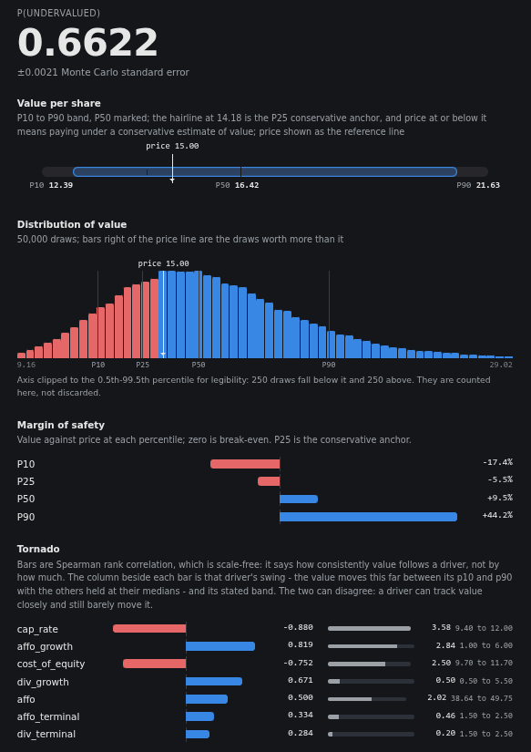

# valdist

A Python engine and CLI for intrinsic-value modelling. It samples the inputs
and returns the distribution – percentiles of intrinsic value,
`P(value > price)` with a Monte Carlo standard error, and a ranking of which
assumption actually moves it. A read-only browser viewer is included for
exploring the results.

> **Note:** the research methodology is not
> included – it's derivative of proprietary work.
> [`docs-example/`](docs-example/) is a public example of
> the *shape* that process takes. Point the viewer or the price fetcher at your
> own specs with `VALDIST_ANALYSES=/path/to/your/specs`.

---

<p align="left"><code>python -m gui.server</code></p>
<p align="left">
  
</p>

---

## Contents

- [Install](#install)
- [Quickstart](#quickstart)
- [Commands](#commands)
- [Dependence model](#dependence-model)
- [Viewer](#viewer)
- [Python API](#python-api)
- [Adapters](#adapters) – [writing your own](#writing-your-own-adapter)
- [Design constraints](#design-constraints)

## Install

```bash
pip install -e .          # core: numpy, scipy, pydantic, typer, PyYAML
pip install -e ".[plot]"  # adds matplotlib, only for `valdist plot`
pytest -q                 # 656 tests, all green
```

## Quickstart

A spec is YAML or JSON. Each driver gets a marginal and a loading per factor;
anything not sampled goes in `constants` and reaches the adapter identically –
promoting a frozen assumption to a sampled driver needs no code change.

```yaml
schema_version: "1.0"
name: "2026-06-28-VICI"
valuation: reit_v2        # reit_v2 | equity_v2 | preferred_v1
price: 27.21
seed: 0
n: 50000
nu: null                  # t-copula degrees of freedom; omit for a Gaussian copula

factors: [rate, fundamentals]

drivers:
  cost_of_equity:
    marginal: {family: normal, p10: 8.25, p50: 9.0, p90: 9.75}
    loadings: {rate: 0.85, fundamentals: -0.10}
  cap_rate:
    marginal: {family: lognormal, p10: 5.5, p50: 6.5, p90: 7.5}
    loadings: {rate: 0.75, fundamentals: -0.30}

constants:
  shares: 1090
  w_ddm: 15
  w_affo: 35
  w_nav: 50
```

Families: `normal`, `lognormal`, `lognormal3`, `triangular`, `pert`. **The
first three read p10/p50/p90 as percentiles; `triangular` and `pert` read them
as hard min/mode/max** – a different claim, so choose them deliberately.
`validate` warns when a family cannot reproduce the triple you typed.

Loadings must satisfy `Σλ² ≤ 1` per driver; the remainder is that driver's
idiosyncratic variance.

Run it:

```bash
valdist run examples/vici.yaml
```

```
  P10  =   28.01   P50  =   33.70   P90  =   40.998
  P25  =   30.53   (the conservative anchor: a BUY BELOW price)
  P(undervalued)  = 0.9312  ±0.0011 (MC stderr)
```

**A clean run prints no `WARNINGS` block, so its presence always means
something.** Read it before the percentiles:

- **Floored draws.** A terminal value divides by *(discount rate − terminal
  growth)*, both sampled, so their bands can cross. Such a draw is not
  pessimistic, it is incoherent, and flooring the divisor inflates it by roughly
  10,000×. The engine counts and reports them rather than blending them in
  silently. Fix the bands; do not caveat the number.
- **`P(undervalued)` of exactly 0 or 1.** The `±0.0000` beside it means no
  spread, not no doubt. Your bands are too narrow to be informative.

The tornado is a **rank correlation** – it says which driver moves the value
monotonically, never by how much. For magnitude use `Model.driver_swings()`;
the two orderings can invert.

## Commands

| Command | What it does |
|---|---|
| `valdist validate <spec>` | Every spec error at once, plus non-fatal quality notices |
| `valdist run <spec>` | Percentiles, `P(undervalued)` ± stderr, tornado, warnings |
| `valdist worlds <spec>` | The driver values behind the P10 / P50 / P90 outcomes |
| `valdist plot <spec> --out f.png` | `--kind tornado\|distribution`, `--theme light\|dark` |
| `valdist calibrate <folder>` | Fraction of realised outcomes inside the P10–P90 band |
| `python -m gui.server` | Read-only local viewer at 127.0.0.1:8756 |
| `python -m prices.fetch [TICKERS]` | Refresh quotes for re-pricing in the viewer |

`run`, `worlds`, `plot` and `calibrate` all take `--sampling mc` (default) or
`lhs` for Latin Hypercube.

## Dependence model

Dependence between drivers is a **factor model** defined by your own
assumptions:

```
z_i = Σ_j λ_ij·f_j + ψ_i·e_i     Σ_j λ_ij² + ψ_i² = 1
Σ   = ΛΛ' + diag(ψ²)             positive semi-definite by construction
```

One factor with unit loadings and ψ=0 gives the comonotonic case (everything
moves together); zero loadings give independence. Both are limits of the same
model, so there is no separate code path for either.

---

## Viewer

`python -m gui.server` serves a **read-only** page over whatever specs it finds
in the directory `$VALDIST_ANALYSES` points at (a local default is used if
unset) – no build step, no JS framework, one HTML file. It runs each spec
through the same engine the CLI uses and renders:

- **List** – filterable, grouped by ticker when a company has multiple runs.
- **Run** – percentiles, tornado, warnings, the histogram, and a price ladder
  showing `P(undervalued)` across a range of prices.
- **Model** – every driver's marginal next to its factor loadings, and whether
  the fitted family reproduces the typed p10/p90.
- **Timeline** – one ticker's runs side by side, so a re-run's change in view
  is separated from the change in price.
- **Portfolio** – every analysis as one table, optionally re-priced from
  `prices/prices.json`.

## Python API

```python
import valdist

result = valdist.run("examples/vici.yaml")  # validates, then runs
result.summary()  # dict, JSON-ready
result.tornado()  # [(driver, rank corr)]
result.warnings()  # [] when there is nothing to declare
```

`hydrate(spec)` builds a `Model` and **refuses a spec `validate()` rejects**,
raising the whole digest at once rather than the first error.

## Adapters

`valuation:` selects the blend; every key it reads must appear as a driver or
a constant, or `validate` refuses the spec. **The set below is what ships
today, not a fixed list** – see [Writing your own](#writing-your-own-adapter).

| Adapter | Blend | Required keys |
|---|---|---|
| `reit_v2` | DDM + AFFO-DCF (FCFE) + cap-rate NAV, weighted `w_ddm`/`w_affo`/`w_nav` | `dps`, `div_growth`, `div_terminal`, `ddm_stage1_years`, `affo`, `affo_growth`, `affo_terminal`, `affo_years`, `cost_of_equity`, `noi`, `cap_rate`, `nav_debt`, `nav_other`, `shares`, `w_ddm`, `w_affo`, `w_nav` |
| `equity_v2` | DCF (FCFF) + EPV + relative, weighted `w_dcf`/`w_epv`/`w_relative` | `fcff`, `fcf_growth`, `terminal_growth`, `wacc`, `years`, `normalized_earnings`, `relative_value_per_share`, `debt`, `cash`, `shares`, `w_dcf`, `w_epv`, `w_relative` |
| `preferred_v1` | Fixed-coupon perpetual with an issuer call option | `par`, `coupon_rate`, `required_yield`, `call_probability`, `years_to_call`, `arrears` |

Query the running set programmatically rather than trusting this table to stay
current:

```python
from valdist.adapters.registry import known_valuations, required_inputs

sorted(known_valuations())
sorted(required_inputs("reit_v2"))
```

### Writing your own adapter

An adapter is one function, `callable(sample: dict) -> float`, registered
under a name. `sample` is the merged `drivers ∪ constants` dict for a single
Monte Carlo draw – the adapter never sees which side of the spec a value came
from. This is the full pattern, condensed from `valdist/adapters/preferred.py`:

```python
from valdist.adapters.floors import floored
from valdist.adapters.registry import register


@register(
    "my_bond_v1",
    requires={"face_value", "coupon_rate", "required_yield", "years"},
    positive_years={"years"},  # validated as int >= 1
    # blend_weights={...}       # only if you blend several methods
)
def my_bond_v1(v: dict) -> float:
    y = floored(v["required_yield"] / 100.0, "my_bond_yield_floored")
    coupon = v["face_value"] * v["coupon_rate"] / 100.0
    n = int(v["years"])
    pv_coupons = sum(coupon / (1 + y) ** t for t in range(1, n + 1))
    pv_face = v["face_value"] / (1 + y) ** n
    return pv_coupons + pv_face
```

Then import the module once, anywhere before the spec is loaded, so the
decorator runs – `valdist/__init__.py` does this for the built-in three:

```python
import valdist.adapters.my_bond  # noqa: F401  (registers on import)
```

Three things the registry enforces on your behalf:

- `requires={...}` is what `validate()` checks a spec against, and what
  `driver_swings()` and the viewer's model tab read to know your adapter's
  input names.
- `positive_years={...}` marks any key that's a projection horizon (rejects
  0 and negative). Leave a horizon out of this set only if zero is a
  legitimate value for it – `require_nonnegative_years` in
  `valdist/adapters/floors.py` is the paired helper for that case.
- **Floor, never raise, on a sampled divisor.** Two bands (say a discount rate
  and a growth rate) can cross on an unlucky Monte Carlo draw; that draw is
  incoherent, not merely pessimistic, and one bad draw must not abort a
  50,000-draw run. `floored()`/`clamped()` in `valdist/adapters/floors.py`
  floor the value, raise a named flag, and let the run continue – the flag
  surfaces in the `WARNINGS` block, counted, so a floored draw is visible
  instead of silently distorting the distribution.

## Design constraints

- **Valuation-agnostic core.** `core/` holds no domain math. A valuation is a
  `callable(sample: dict) -> float`; REIT, equity and preferred logic live in
  `valdist.adapters`. Adapters surface per-draw conditions through a generic
  named-flag channel – the engine counts flags without knowing what they mean.
- **Determinism.** Same spec + seed → identical output, whatever the sampling
  mode.
- **No overfitting.** Loadings and marginals are authored, never fitted to
  historical returns. Calibration only *checks* coverage.
- **Numbered anchors.** Each constraint above is pinned by a numbered
  regression test, and `# Anchor #N` comments in `tests/` mark which test
  defends which property – e.g. anchor 5 pins the golden spec's percentiles to
  1e-4, and anchor 13 pins that floored draws are counted and surfaced. The
  numbering is what stops a constraint from quietly becoming a comment.

---

## License

MIT
